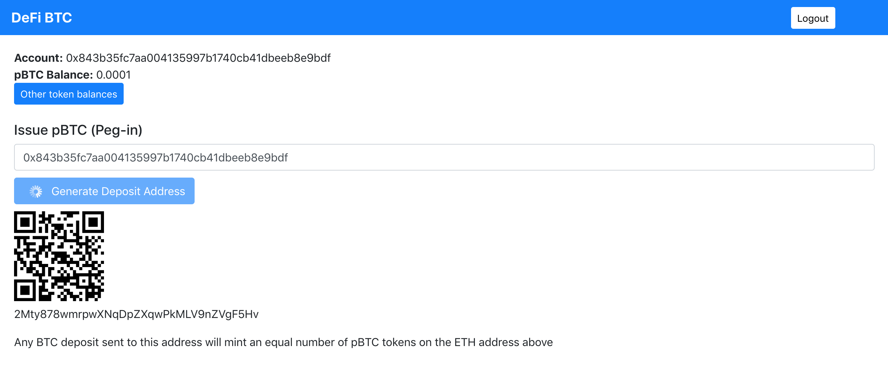
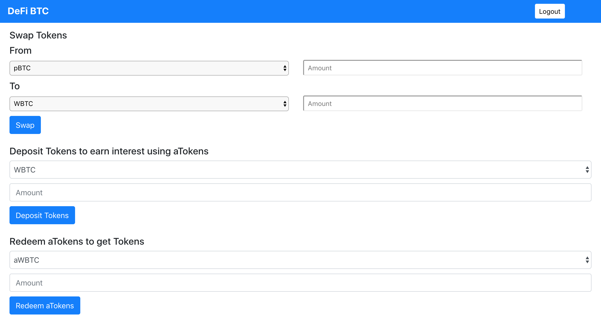

## DeFi BTC

DeFi BTC showcases the DeFi capabilities for Bitcoin once BTC is converted to pBTC. 
DeFi BTC leverages Ethereum and DeFi composability to add new features to Bitcoin.
Using DeFi BTC you can deposit Bitcoin and get equivalent pBTC (Powered by pTokens). 
The pBTC tokens can be redeemed for Bitcoin anytime. 

You can then swap pBTC to ERC20 tokens like WBTC, DAI, USDT, etc (Powered by Uniswap V2). You can then deposit 
any Aave supported tokens to earn interest using aTokens. e.g. Deposit WBTC to earn interest using aWBTC. You earn
interest for every Ethereum block. The aTokens can be redeemed to get Tokens back anytime.

DeFi BTC also allows you to easily Stream tokens like pBTC, WBTC, DAI, Aave Interest Bearing Tokens, etc 
(Powered by Sablier). You can also redeem tokens from the stream in a single click.

DeFi BTC also allows you to send or receive any ERC-20 Tokens like aDAI, pBTC, DAI, etc. You can also use our 
[open source project](https://github.com/viraja1/erc_20_payments) to process ERC-20 token payments for aDAI, pBTC, DAI, etc. It is a non custodial solution which 
allows you to trigger your own purchase flow on transfer confirmation.

### App Link

DeFi BTC (Ropsten Network) - https://defi-btc.netlify.app/ 

For Ropsten network, DeFi BTC uses Aave version of DAI, WBTC and other ERC-20 tokens.
You can get these tokens from the Aave Faucet (https://testnet.aave.com/faucet). 
You can get some ETH from the Ropsten faucet (https://faucet.ropsten.be/).


### Screenshots








### Getting Started

1) Clone the repo

   ```
   git clone https://github.com/viraja1/defi_btc.git 
   ```

2) Change Directory

   ```
   cd defi_btc
   ```
   
3) Install packages

   ```
   npm install
   ```
   
4) Register the app on Portis and get dappId. Then replace portisDappId in src/App.js

   https://dashboard.portis.io/
   
5) Start the app   

   ```
   npm start 
   ```
   
6) Test the app

   http://localhost:3000/ 
   
7) Get tokens from faucet
    
   https://faucet.ropsten.be/
   
   https://testnet.aave.com/faucet